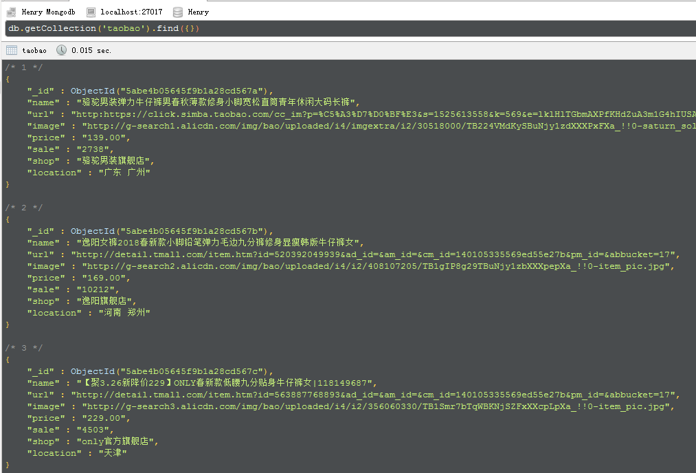

淘宝商品信息的定向爬取 
===========================
   
### 淘宝官网 - https://www.taobao.com/ 
|Author|:sunglasses:Henryhaohao:sunglasses:|
|---|---
|Email|:hearts:1073064953@qq.com:hearts:

    
****
## :dolphin:声明
### 2018-10-12: 
### 淘宝更新反爬机制--点击搜索后,会触发反爬检测,直接跳转到了登录页面;解决方案:模拟登录后再进行爬取, 但是这个模拟登录需要过个滑块验证码,直接用selenium过滑块发现完全不行; 
### 参考知乎上这篇文章:[https://www.zhihu.com/question/35538123]();发现淘宝的UA验证原理大概是这样的，从页面加载完成后，就开始搜集用户在页面上的操作，包括鼠标的点击，移动轨迹，按下，松开，滑动块的拖动，同时还包括时间等信息，然后根据某种算法，生成一个字符串，拼接起来。最后在登录或者 验证用户名的请求中，作为名字叫ua的参数传递到服务器。当然，它收集的次数是有限的，达到一定限制后，会停止。难点在于，这个过程非常的复杂，相关的js被混淆，但凡有价值的数值(2000多个)，全放在几个数组中，通过数组[下标]的形式访问，完全搞不懂什么逻辑什么意思，调试起来异常艰难。(:◎)≡
### 总结一下: 这个淘宝项目暂时GG了,以后慢慢研究吧~~如果大佬有更好的解决方案,欢迎打扰~:smile:
## :dolphin:介绍
### 该项目为[淘宝网](https://www.taobao.com/)商品信息的定向爬虫
- 项目介绍:通过淘宝搜索关键字爬取指定的商品信息
- 爬取方式:通过Python的Selenium自动化测试库以及配合Phantomjs无头浏览器
- 爬虫文件:运行Spiders目录下的spider.py
- 配置文件:运行前修改Spiders目录下的config.py,其中的KEYWORD为你要搜索商品名称的关键字,以及mongodb相关配置
- 补充:如果想要增加爬取的字段,可以自行在item中添加,目前包括商品名、城市、详情链接、封面、售价、销量、店铺名
## :dolphin:运行环境
Version: Python3
## :dolphin:安装依赖库
```
pip3 install -r requirements.txt
```
## :dolphin:运行截图
> - **运行**<br><br>

> - **数据结构**<br><br>
